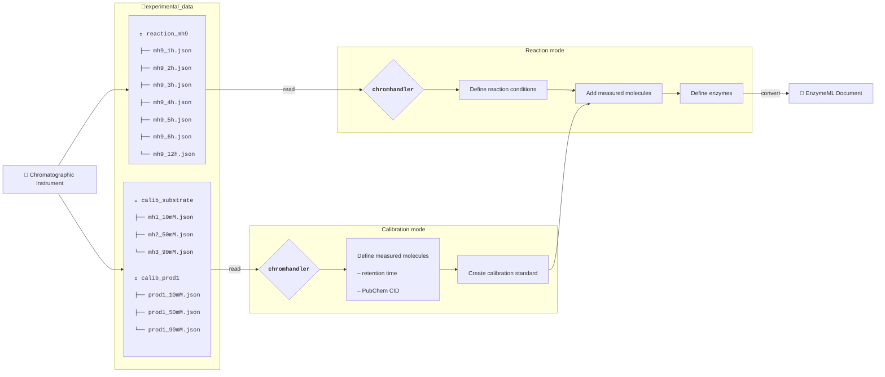

# Chromhandler - handling time-resolved chromatographic data


[](https://fairchemistry.github.io/Chromhandler/)
[](https://github.com/FAIRChemistry/Chromhandler/actions/workflows/run_tests.yaml)
[](https://codecov.io/gh/FAIRChemistry/Chromhandler)


## ℹ️ Overview

`chromhandler` (formerly `chromatopy`) is a Python package that aims to streamline the data processing and analysis of time-course chromatographic reaction data. It allows processing raw or pre-processed chromatographic data, enriching it with metadata such as reaction time, temperature, pH, and initial concentrations of reaction components. Finally, the peaks of interest can be aggregated, concentrations calculated, and the time-course data for each analyte transformed to EnzymeML data.

`chromhandler` is designed to work seamlessly with [OpenChrom](https://lablicate.com/platform/openchrom), enabling batch processing of proprietary chromatographic data. After processing in OpenChrom and exporting to an open file format, the data can be further analyzed in Jupyter Notebooks using `chromhandler`. This allows for creating and applying calibration curves and generating EnzymeML files for subsequent data analysis.
For some output formats, `chromhandler` provides a direct interface to read in data. For more information on the supported file formats and data preparation to use the `chromhandler` workflow, refer to the [data preparation](https://fairchemistry.github.io/chromhandler/supported_formats/#supported-formats) section.



## ⭐ Key Features

- **🌱 Low friction data processing**   
Leave behind data processing in spreadsheet applications and directly start with data analysis based on raw data.
- **🧪 Enrich reaction data with metadata**  
Assign metadata like initial concentrations of reactants, temperature, pH, etc., to reaction data to yield modeling-ready data.
- **📈 Create and apply calibration curves**  
Create calibrators for your analytes and use them throughout your data analysis for seamless concentration calculation.
- **📂 FAIR data**  
Transform your data into EnzymeML format for subsequent analysis pipelines.
- **⏱️ Retention-time alignment**  
Correct for drift between runs using X-axis-only shift optimization with multi-start Adam.

## 🛠️ Installation

Install `chromhandler` using `pip`:

```bash
pip install chromhandler
```

or


```bash
pip install git+https://github.com/FAIRChemistry/Chromhandler.git
```

## ⏱️ Retention-Time Alignment

`chromhandler` provides built-in retention-time alignment for time-course chromatographic data using the `align_chromatograms` function. This addresses common issues like column drift, temperature fluctuations, or flow-rate variations that cause peaks to shift between runs.

### How It Works

The alignment algorithm uses a **X-axis-only constraint**: it adjusts the retention time axis without modifying signal intensities (y-values). This preserves the physical meaning of the measured concentrations while correcting for technical variation.

**Algorithm overview:**

1. **Coarse initialization** via masked cross-correlation finds integer-lag estimates for each chromatogram
2. **Multi-start Adam optimization** refines these to continuous shift values in parallel
3. **Loss function** = MSE between shifted traces and consensus template, plus L2 penalty on mean shift

### Assumptions

- **Retention time drift is additive**: Each chromatogram is shifted by a constant offset (no warping)
- **X-axis-only contract**: Signal intensities remain unchanged; only the time axis is updated
- **High-intensity regions dominate**: The sum-of-squared-residuals loss naturally weights high-concentration regions more heavily
- **Masked alignment**: Users should specify which timepoints to use (typically peak windows + baseline regions)

### Usage Example

```python
from chromhandler.fitting.shift import align_chromatograms

# signal: [C, N] chromatograms × timepoints
# mask: [C, N] boolean array marking regions to align (e.g., peaks + baseline)
result = align_chromatograms(signal, mask, lr=1e-2, n_steps=500)

# Apply shifts to time axis (not signal values!)
time_aligned = time_original + result.shifts_samples * dt
# signal stays as: result.signal_aligned
```

### Key Parameters

| Parameter | Default | Description |
|-----------|---------|-------------|
| `lr` | 1e-2 | Adam learning rate |
| `n_steps` | 500 | Optimizer iterations per start |
| `n_starts` | 16 | Number of independent optimization starts (robustness) |
| `center_weight` | 1e3 | Penalty on mean shift (keeps traces zero-centred) |
| `max_shift_samples` | None | Hard bound on shift magnitude |

For more technical details, see the [API reference](https://fairchemistry.github.io/chromhandler/reference/fitting/).

For more information and examples, please refer to the [Documentation](https://fairchemistry.github.io/chromhandler/) section.
