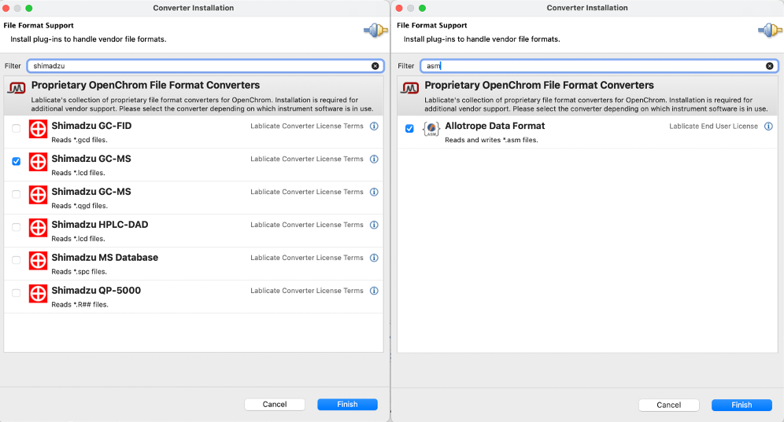
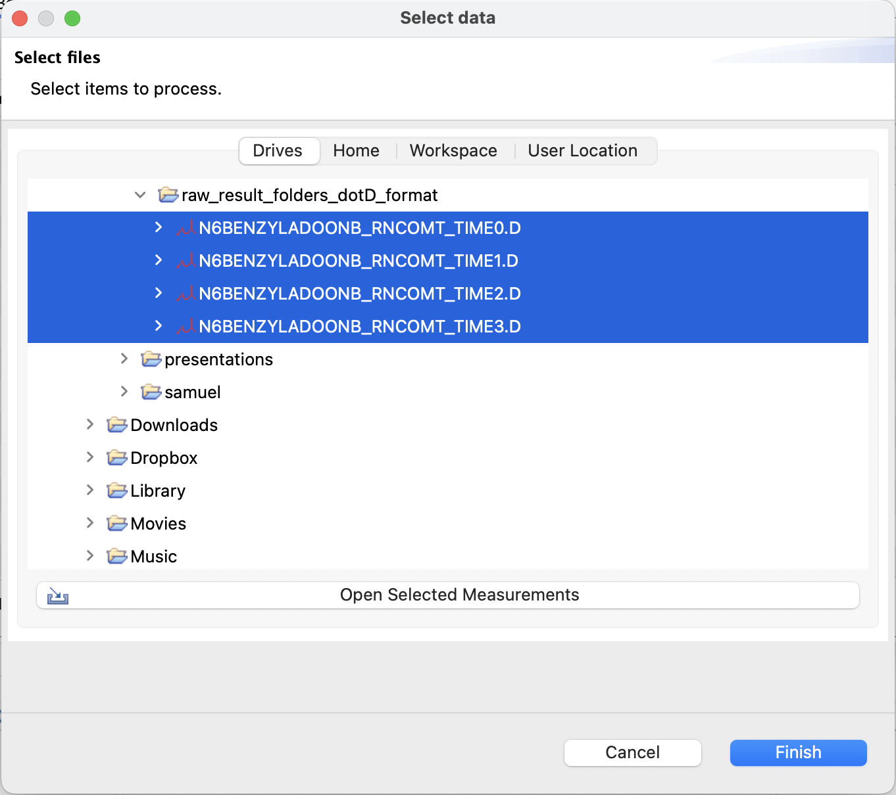
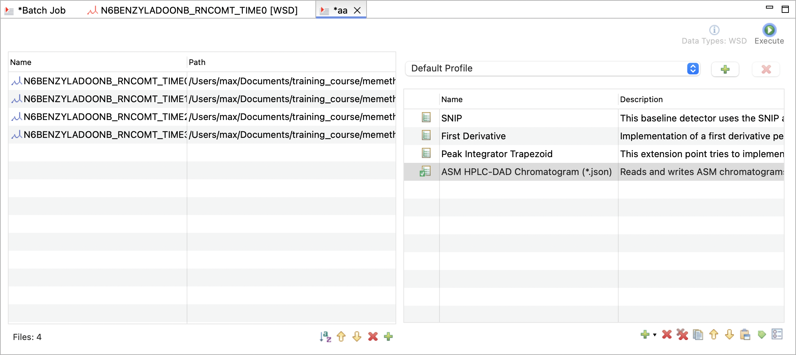

# Data Preparation

`chromhandler` supports two fundamental analysis workflows:

__🎯 **Calibration Mode**__  
- **Purpose**: Create calibration curves from standard samples  
- **Input**: Peak tables of standard samples  
- **Output**: Calibration models for concentration calculation  
- **Typical use**: External standards, method validation  

__⏱️ **Timecourse Mode**__  
- **Purpose**: Track analyte concentrations over time  
- **Input**: Peak tables of reaction mixtures at different time points  
- **Output**: Time-resolved concentration data, EnzymeML documents  
- **Typical use**: Enzyme kinetics, reaction monitoring  

For facilitating swift processing of data, it has to be organized in a specific way.

## 📂 Data organization

`chromhandler` requires a specific organization of the measurement data of a time-course or calibration series. The scope of one analysis run is therefore eighter a single sample which is measured over time or a calibration series with multiple samples for different concentrations. 

!!! example
    An exemplary consisting of calibration mensurements and time-course data should be organized as follows:
    ```
    📂 Project
    │
    ├── 📂 Calibration
    │   ├── abts_1uM.json
    │   ├── abts_50uM.json
    │   └── abts_300uM.json
    │
    └── 📂 B002
        ├── B002_12h.json
        ├── B002_24h.json
        └── B002_36h.json
    ```
### Calibration data

- The set of calibration data files should be stored within a single folder.
- Deposit the concentration including the unit in the file name. E.g. `abts_1uM.json` `abts_50uM.json` `abts_300uM.json`. In this case the concentration can be automatically extracted from the file name.

### Time-course data

- All data files of a time-course series should be stored within a single folder.
- Name the folder after your sample ID. E.g. `B002`.
- Deposit the reaction time including the unit in the file name. E.g. `B002_12h.json` `B002_24h.json` `B002_36h.json`. This allows to automatically extract the reaction time and unit from the file name.


## 🔧 Supported Formats

Most output data from chromatographic devices is vendor-specific and proprietary. However, [OpenChrom](https://lablicate.com/platform/openchrom), an open-source software that is free for academic use, provides the tools to convert proprietary data from almost all vendors into a vendor-neutral and machine-readable format, specifically the Allotrope Simple Model (ASM). A complete list of supported formats for pre-processing with OpenChrom can be found [here](https://www.openchrom.net/).

Peak detection and integration with subsequent export to the ASM format is the recommended way to prepare data for subsequent processing with `chromhandler`. For information on how to batch process chromatographic data with OpenChrom, please refer to the section [Spectrum Processing with OpenChrom](#spectrum-processing-with-openchrom-from-lablicate).

### Allotrope Simple Model

!!! info
    The [Allotrope Simple Model (ASM)](https://www.allotrope.org/asm) is a JSON-based and vendor-independent format for analytical data. It is designed to store chromatographic measurement data.

The ASM format is the preferred format for data import. It can be exported from OpenChrom and contains the measured signal and data of all peaks which were processed by OpenChrom. The format is supported by `chromhandler` and can be imported directly.

### Vendor specific formats

As an alternative to the ASM format, `chromhandler` supports the import of chromatographic data from various vendors.  Samples of all supported formats are provided below.

??? example "File Examples"

    === "Agilent REPORT.TXT"

        ```
        Data File C:\CHEM32\1\DATA\H 2023-07-24 21-36-55\001F0104.D
        Sample Name: DFA-708-01
        Instrument 1 7/24/2023 10:34:06 PM Group

        =====================================================================
        Acq. Operator   : Group                           Seq. Line :   1
        Acq. Instrument : Instrument 1                    Location : Vial 1
        Injection Date  : 7/24/2023 10:22:05 PM                Inj :   4
                                                        Inj Volume : 1000 µl
        Sequence File   : C:\Chem32\1\DATA\07-24 21-36-55\H.S
        Method          : C:\CHEM32\1\DATA\07-24 21-36-55\H.M (
                        Sequence Method)
        Last changed    : 7/24/2023 4:35:09 PM
        =====================================================================
                                Area Percent Report                         
        =====================================================================

        Sorted By             :      Signal
        Multiplier            :      1.0000
        Dilution              :      1.0000
        Use Multiplier & Dilution Factor with ISTDs


        Signal 1: FID1 A, 

        Peak RetTime Type  Width     Area      Height     Area  
        #   [min]        [min]   [pA*s]      [pA]         %
        ----|-------|----|-------|----------|----------|--------|
        1   2.828 BB    0.0857 1.95364e4  3417.83057 99.52651
        2   4.059 BB    0.0745   92.94276   18.85831  0.47349
        Totals :                  1.96294e4  3436.68888


        Signal 2: TCD2 B, 

        Peak RetTime Type  Width     Area      Height     Area  
        #   [min]        [min]  [25 uV*s]   [25 uV]       %
        ----|-------|----|-------|----------|----------|--------|
        1   2.832 BB    0.0841 1090.67725  195.31581 1.000e2 
        Totals :                  1090.67725  195.31581

        =====================================================================
                                Summed Peaks Report                         
        =====================================================================

        Signal 1: FID1 A, 
        Signal 2: TCD2 B, 
        =====================================================================
                            Final Summed Peaks Report                      
        =====================================================================

        Signal 1: FID1 A, 
        Signal 2: TCD2 B, 
                                *** End of Report ***
        ```

    === "Agilent RESULTS.CSV"

        ```
        [contents]
        count=1
        Name=,D:\MassHunter\GCMS\RAU-R505-0.D
        1=,INT TIC: RAU-R505-0.D\data.ms
        [INT TIC: RAU-R505-0.D\data.ms]
        Time=,Thu Jun 06 17:25:48 2024
        Header=,"Peak","R.T.","First","Max","Last","PK  TY","Height","Area","Pct Max","Pct Total"
        1=,  1,  6.056,  856, 860, 880,"  M ",1366398, 13751453,100.00, 63.328
        2=,  2,  6.302,  899, 903, 909,"  M ",1063632,  7963360, 57.91, 36.672
        ```

    === "Agilent rdl formatted *.TXT"

        ```
        ┌──────────────────────────────────────────────────────────────────────────────┐
        │Cross Sequence Summary Report                                                 │
        └──────────────────────────────────────────────────────────────────────────────┘
        ┌────────────────┬──────────────────────────────────────────────────────────┐
        │Sample Name     │M2_MJ_                                                    │
        │                │100_min                                                   │
        └────────────────┴──────────────────────────────────────────────────────────┘
        ┌───────┬────────────────────────────────────────────────────────────────────┐
        │Signal:│DAD1A,Sig=254,4  Ref=360,100                                        │
        └───────┴────────────────────────────────────────────────────────────────────┘
        ┌───────┬───┬────────┬────────┬───────┬────────┬─────────────────────────────┐
        │    RT │Typ│  Width │   Area │ Height│  Area% │Name                         │
        │ [min] │e  │  [min] │        │       │        │                             │
        ├───────┼───┼────────┼────────┼───────┼────────┼─────────────────────────────┤
        │ 0.698 │BV │ 0.4062 │    53. │ 7.2642│ 0.3671 │                             │
        │       │   │        │   0992 │       │        │                             │
        ├───────┼───┼────────┼────────┼───────┼────────┼─────────────────────────────┤
        │ 1.169 │VV │ 0.8468 │  6094. │   783.│    42. │AMP@1,169min                 │
        │       │   │        │   3336 │   0775│   1289 │                             │
        ├───────┼───┼────────┼────────┼───────┼────────┼─────────────────────────────┤
        │ 2.756 │VB │ 0.4315 │    14. │ 1.9341│ 0.0982 │                             │
        │       │   │        │   2114 │       │        │                             │
        ├───────┼───┼────────┼────────┼───────┼────────┼─────────────────────────────┤
        │ 3.331 │BV │ 0.7823 │  7620. │   925.│    52. │ADP@3,327min                 │
        │       │   │        │   7030 │   5433│   6804 │                             │
        ├───────┼───┼────────┼────────┼───────┼────────┼─────────────────────────────┤
        │ 3.974 │VB │ 1.5648 │   381. │    55.│ 2.6397 │                             │
        │       │   │        │   8593 │   0016│        │                             │
        ├───────┼───┼────────┼────────┼───────┼────────┼─────────────────────────────┤
        │ 5.770 │BB │ 1.0452 │   301. │    22.│ 2.0856 │ATP@5,720min                 │
        │       │   │        │   7014 │   1066│        │                             │
        ├───────┼───┼────────┼────────┼───────┼────────┼─────────────────────────────┤
        │       │   │    Sum │ 14465. │       │        │                             │
        │       │   │        │   9079 │       │        │                             │
        └───────┴───┴────────┴────────┴───────┴────────┴─────────────────────────────┘
        ┌───────────────────────────┬────────────────────────────────┬─────────────────┐
        │D:\CDSProjects\JNS\Report  │     Printed:  2024-10-20       │    Page 1 of 1  │
        │Templates\Export_for_      │        16:25:44+02:00          │                 │
        │python.rdl [Rev. 2.0]      │                                │                 │
        ════════════════════════════════════════════════════════════════════════════════
        ```

    === "Shimadzu *.TXT"

        ```
        [Header]
        Application Name,LCsolution
        Version,1.25
        Data File Name,C:\LabSolutions\0.lcd
        Output Date,12.12.2023.
        Output Time,11:18:30

        [File Information]
        Type,Data File
        Generated,21.2.2012. 13:16:32
        Generated by,Admin
        Modified,21.2.2012. 13:33:38
        Modified by,Admin

        [Sample Information]
        Operator Name,Admin
        Acquired,21.2.2012. 13:16:57
        Sample Type,0:Unknown
        Level,0
        Sample Name,0
        Sample ID,
        ISTD Amount 1,1
        ISTD Amount 2,1
        ISTD Amount 3,1
        ISTD Amount 4,1
        ISTD Amount 5,1
        ISTD Amount 6,1
        ISTD Amount 7,1
        ISTD Amount 8,1
        ISTD Amount 9,1
        ISTD Amount 10,1
        ISTD Amount 11,1
        ISTD Amount 12,1
        ISTD Amount 13,1
        ISTD Amount 14,1
        ISTD Amount 15,1
        ISTD Amount 16,1
        ISTD Amount 17,1
        ISTD Amount 18,1
        ISTD Amount 19,1
        ISTD Amount 20,1
        ISTD Amount 21,1
        ISTD Amount 22,1
        ISTD Amount 23,1
        ISTD Amount 24,1
        ISTD Amount 25,1
        ISTD Amount 26,1
        ISTD Amount 27,1
        ISTD Amount 28,1
        ISTD Amount 29,1
        ISTD Amount 30,1
        ISTD Amount 31,1
        ISTD Amount 32,1
        Sample Amount,1
        Dilution Factor,1
        Vial#,1
        Injection Volume,20

        [Original Files]
        Data File,C:\LabSolutions
        Method File,C:\LabSolutions
        Batch File,C:\LabSolutions
        Report Format File,C:\LabSolutions
        Tuning File,

        [File Description]


        [Configuration]
        # of Detectors,2
        Detector ID,Detector A,AD2
        Detector Name,Detector A,AD2
        # of Channels,1,1

        [Peak Table(Detector A-Ch1)]
        # of Peaks,14
        Peak#,R.Time,I.Time,F.Time,Area,Height,A/H,Conc.,Mark,ID#,Name,k',Plate #,Plate Ht.,Tailing,Resolution,Sep.Factor,Conc. %,Norm Conc.
        1,0.143,0.017,0.342,1278,107,11.9230,0.0000,   ,,,0.000,4,41558.735,1.160,0.000,0.000,0.0000,0.0000
        2,2.677,2.600,2.842,7633,868,8.7930,0.0000,   ,,,17.675,2267,66.156,1.540,9.621,0.000,0.0000,0.0000
        3,3.113,2.867,3.492,74069,3235,22.8950,0.0000,   ,,,20.715,284,528.740,0.000,0.904,1.172,0.0000,0.0000
        4,3.674,3.492,4.225,62448,1896,32.9390,0.0000, V ,,,24.632,195,767.696,0.000,0.627,1.189,0.0000,0.0000
        5,4.541,4.225,4.858,61821,2075,29.7890,0.0000, V ,,,30.681,11,13168.368,0.000,0.270,1.246,0.0000,0.0000
        6,5.264,4.858,6.025,591150,23289,25.3830,0.0000, V ,,,35.719,1559,96.223,0.000,0.244,1.164,0.0000,0.0000
        7,6.234,6.025,6.417,69898,3040,22.9950,0.0000, V ,,,42.488,8,18539.786,0.000,0.209,1.189,0.0000,0.0000
        8,6.570,6.417,6.708,51229,2962,17.2940,0.0000, V ,,,44.832,6,27270.488,0.000,0.034,1.055,0.0000,0.0000
        9,7.099,6.708,7.442,271461,9085,29.8790,0.0000, V ,,,48.524,1106,135.634,0.000,0.088,1.082,0.0000,0.0000
        10,8.063,7.442,8.950,2838883,74297,38.2100,0.0000, V ,1,RT8.063,55.243,1156,129.804,0.000,1.069,1.138,0.0000,0.0000
        11,9.083,8.950,10.367,458569,7811,58.7060,0.0000, V ,,,62.362,26,5780.190,0.000,0.253,1.129,0.0000,0.0000
        12,10.392,10.367,11.067,150804,3848,39.1900,0.0000, V ,,,71.492,1,157400.235,0.000,0.053,1.146,0.0000,0.0000
        13,11.391,11.067,12.442,273652,3881,70.5040,0.0000, V ,,,78.463,96,1566.775,0.000,0.042,1.098,0.0000,0.0000
        14,12.567,12.442,14.967,184099,2616,70.3870,0.0000, V ,,,86.664,13,11724.488,0.000,0.126,1.105,0.0000,0.0000

        [Peak Table(AD2)]
        # of Peaks,0

        [Peak Table(PDA-Ch1)]
        # of Peaks,0

        [Compound Results(Detector A)]
        # of IDs,1
        ID#,Name,R.Time,Area,Height,Conc.,Curve,3rd,2nd,1st,Constant,Conc. %,Norm Conc.
        1,RT8.063,8.063,2838883,74297,0.0000,Linear,0.0,0.0,0.0,0.0,0.0000,0.0000

        [Compound Results(AD2)]
        # of IDs,0

        [Compound Results(PDA)]
        # of IDs,0

        [Group Results(Detector A)]
        # of Groups,0

        [Group Results(AD2)]
        # of Groups,0

        [Group Results(PDA)]
        # of Groups,0

        [LC Chromatogram(Detector A-Ch1)]
        Interval(msec),500
        # of Points,1801
        Start Time(min),0.000
        End Time(min),15.000
        Intensity Units,mV
        Intensity Multiplier,0.001
        Wavelength(nm),215
        R.Time (min),Intensity
        0.00000,-132
        0.00833,-132
        0.01667,-52
        0.02500,3
        0.03333,8
        ...
        ```

    === "Thermo Fisher Scientific *.TXT"

        ```
        Filepath	C:¥Chromel¥data¥HPLC¥2_Data¥UV_VIS_1.CHL¥20.acd
        Channel	UV_VIS_1

        Sample Information:
        Datasource	BCI
        Sequence	HPLC¥2_Data
        Sample	A 1,0 mM
        Sample Number	31
        Sample Position	RD3
        Sample ID	20
        Comment	
        QNT method	20211221
        PGM file	20230109
        Type	standard
        Status	finished
        Date	02.02.2023
        Time	16:12:23
        Injection Volume (ｵl)	10,00
        Dilution Factor	1,000000
        Amount	1,000000
        Weight	1,000000

        Raw Data Header Information:
        Time Min. (min)	0,000
        Time Max. (min)	44,000
        Raw-Time Min. (min)	0,000
        Raw-Time Max. (min)	44,000
        Data Points	26401
        Detector	VWD3000.dll
        Preferred Read Mode	Unknown
        Write Mode	Unknown
        Data System	Chromeleon
        Version High	06
        Version Low	80
        Build No.	3160
        File Format Version	11
        Generation Type	8
        File ID	239054205
        File Status	16
        GUID	8ce9b975
        Signal Factor	0,000010
        Signal Dimension	mAU
        Signal Unit	Absorbance
        Signal Min.	-2,8254
        Signal Max.	576,766300
        Channel Name	UV_VIS_1
        Driver Name	VWD-3x00(RS) Detector
        Min. Step	10
        Max. Step	10
        Average Step	10

        Signal Parameter Information:
        Signal Info	WVL:254 nm
        Wavelength	254 nm

        Raw Data:
        Time(min)	Step(sec)	Value(mAU)
        0,000000	0,00	0,125090	
        0,001667	0,10	0,125010	
        0,003333	0,10	0,124540	
        0,005000	0,10	0,124710	
        0,006667	0,10	0,123320	
        0,008333	0,10	0,123160	
        ...
        ```

## 🌈 Spectrum Processing with OpenChrom (from Lablicate)

!!! info
    [OpenChrom](https://lablicate.com/platform/openchrom) is an open‑source application for chromatography, spectrometry and spectroscopy. It natively imports data from most GC/MS, GC/FID, HPLC‑DAD and related instruments, offers high‑throughput batch processing (baseline correction, peak detection/integration, reporting) and exports results to the vendor‑independent Allotrope Simple Model (ASM) format—ready for use with `chromhandler`.

### Installation & plug‑in setup

1. Download the current OpenChrom release from the [official site](https://www.openchrom.net/download) and install it.
2. Activate the [Allotrope Simple Model (ASM) plugin](https://lablicate.com/marketplace/extensions/allotrope) (free for academic use) to export the data in the ASM format.
3. Add import converters – in OpenChrom choose `Plug‑ins ➜ Install Converters`, search for your vendor (e.g. *Agilent*, *Waters*, *Shimadzu*) and install the matching plug‑ins.  
   For ASM export, search for **asm** and install the *Allotrope Simple Model* plug‑in.  
   { align=left }

### Batch processing

1. Open OpenChrom and navigate to `Chromatogram` > `Batch Process`.

2. A new window will open, where you need to specify a new _Project_. Afterwards, a name for the _Batch Process_ can be defined.

3. Now the _Chromatogram Batch Process_ mode needs to be defined. Depending on you data, one of the following modes can be selected. The processing might fail if the wrong mode is selected.
    - `WSD`: Wavelength Spectrum Data
    - `MSD`: Mass Spectrum Data
    - `CSD`
    - `VSD`

4. Now a _Batch Job_ window is opened. The window is divided into the left side, where files can be added, and the right side, where the processing steps can be defined.

5. Add the files you want to process by clicking on the :material-plus: icon in the bottom of the left side. The files can be selected from the file system.


6. Add proccessing steps by clicking on the :material-plus: icon in the bottom of the right side. The following steps are recommended for peak processing and can be added with default parameters:
    - `Baseline Detector` > `SNIP`
    - `Peak Detector` > `First Derivative`
    - `Peak Integrator` > `Peak Integrator Trapezoid`
    - `Chromatogram Export` > `ASM ... (*.json)` then define the output folder.

7. Run the batch process by clicking on the _Execute_ :material-play: icon in the top right corner.


8. After the processing is finished, the data can be imported with `chromhandler`.

### What if my data cannot be processed with OpenChrom?

If the OpenChrom converter for your data does not work as expected, please check the [OpenChroms Issues](https://github.com/OpenChrom/openchrom/issues), if it is a known issue. If not, consider submitting an issue to the OpenChrom repository.